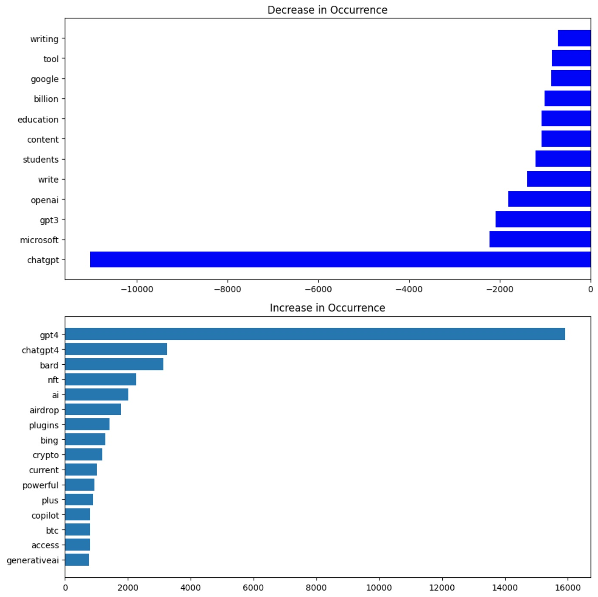

# ChatGPT Tweet Analysis 📊

Welcome to the **ChatGPT Tweet Analysis** project repository! This project aims to provide insights into the technology interest trends surrounding ChatGPT by analyzing related tweets over time. By examining the Twitter data, we can gain a deeper understanding of the community's engagement and sentiment towards ChatGPT.

  

## Project Structure

- `main.py`: The main script for performing the tweet analysis.
- `Twitter Jan Mar.zip`: Zip file containing the data used for analysis.
- `results/`: Directory to store the generated analysis results and visualizations.

## Contributing

Contributions are always welcome! If you find any issues or have suggestions to improve this project, please open an issue or submit a pull request.

## License

This project is licensed under the [MIT License](https://github.com/Jdka1/ChatGPT-Tweet-Analysis/blob/main/LICENSE).

## Acknowledgments

Special thanks to the contributors and the OpenAI team for their amazing work on ChatGPT!

---

Happy analyzing! 🚀🔍
